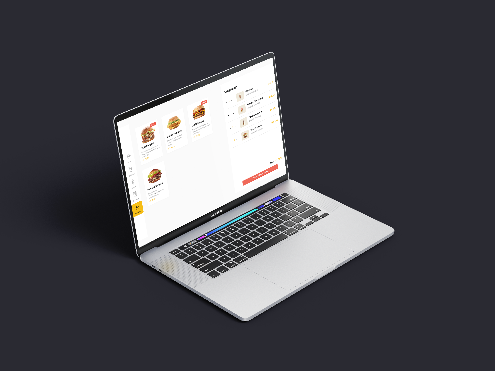

# Restaurante Digital

## Visão Geral

O **Restaurante Digital** é um aplicativo desenvolvido em Vue.js. Ele foi criado para gerenciar pedidos de restaurantes de forma simples e prática. Seu desenvolvimento permite o gerenciamento de pedidos, inserção de observações, carrinhos com os itens, e seleção até mesmo de endereço para entrega do pedido ou retirada em take-out. 

## Tecnologias Utilizadas

O projeto **Restaurante Digital** foi desenvolvido utilizando as seguintes tecnologias:

- **Vue.js 2**: Framework JavaScript progressivo para construir interfaces de usuário.
- **FeatherIcons**: Biblioteca de ícones vetoriais.
- **Less**: Pré-processador CSS.
- **VueX**: Gerenciador de estado + biblioteca para aplicações Vue.js.
- **Vue Router**: Gerenciador de rotas oficial para aplicativos Vue.
- **Axios**: Responsável pelas requisições HTTP ao servidor.
- **JSON Server**: Mock da API utilizada para consumo dos itens da aplicação em servidor.


## Como Clonar e Executar o Projeto

### Pré-requisitos

- Node.js instalado
- npm (ou yarn) instalado

### Passos

1. Clone o repositório do **Restaurante Digital**:

    ```bash
    git clone https://github.com/mguilherm/restaurant.git
    ```

2. Acesse o diretório do projeto:

    ```bash
    cd restaurant
    ```

3. Instale as dependências do projeto:

    ```bash
    npm install
    ```

    ou

    ```bash
    yarn install
    ```

4. Inicie o servidor com o mock da API:
    ```bash
    json-server --watch db.json
    ```

5. Execute o projeto:

    ```bash
    npm run serve
    ```

    ou

    ```bash
    yarn serve
    ```

6. Acesse o aplicativo em seu navegador em [http://localhost:8080](http://localhost:8080).

## Screenshots

O aplicativo é totalmente resposivo, podendo ser utilizado em suas versões para Desktops, tablets ou até mesmo celulares.


### Web



### Tablet


### Mobile


## Demonstração


---

Com estas instruções, você deverá ser capaz de clonar o repositório, instalar as dependências, iniciar a API, e executar o projeto **Restaurante Digital** em seu ambiente local. Se precisar de mais ajuda, sinta-se à vontade para entrar em contato comigo.

## Implementações Futuras

- Integração com Firebase para criação de backend mais robusto;
- Implementação de método de pagamento online;
- Login para usuários com histórico de compras, itens favoritos e endereço salvo;


